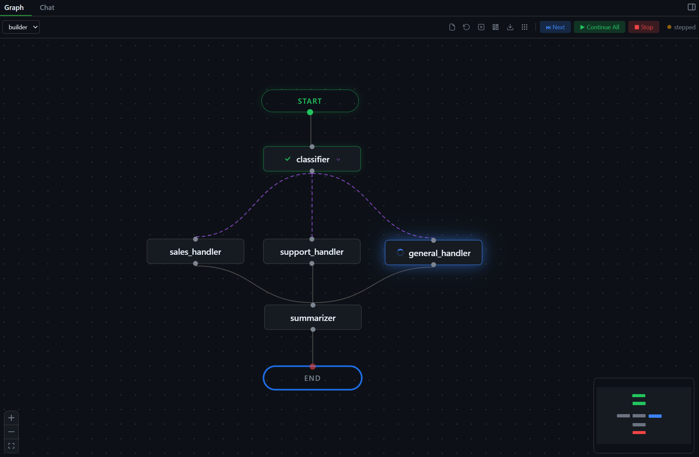
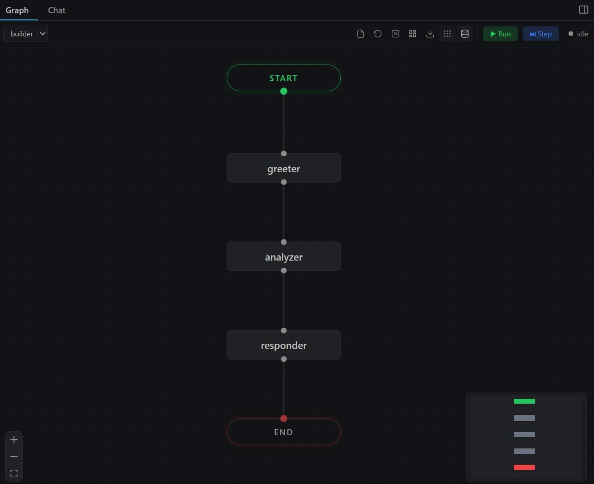
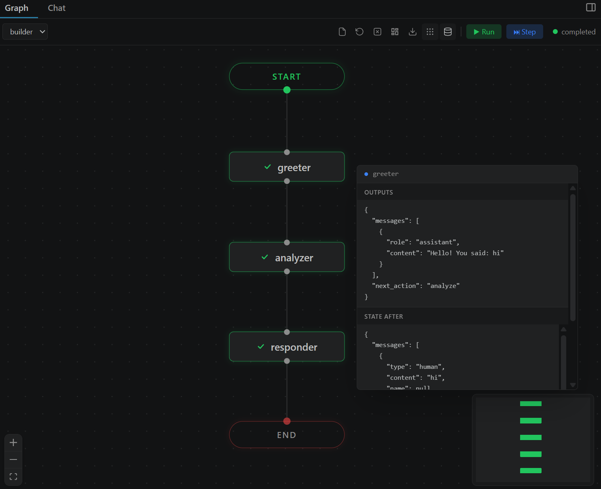
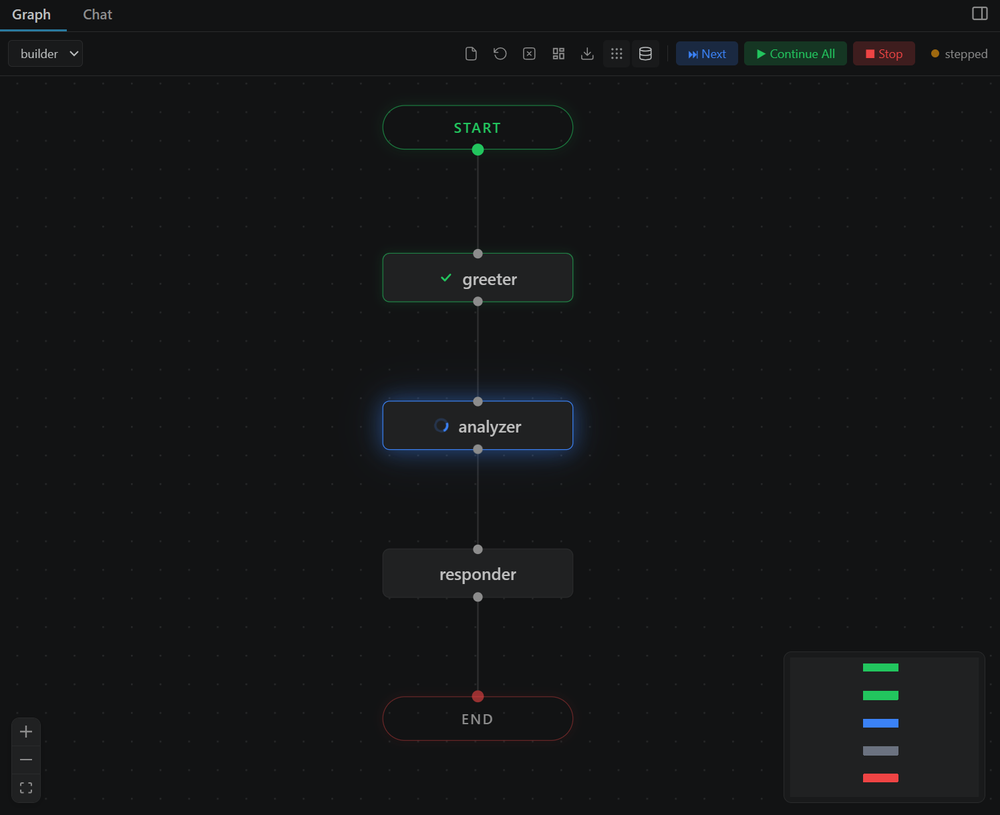
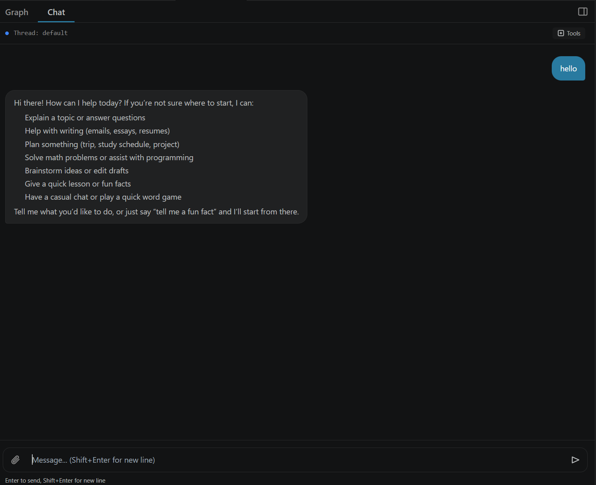
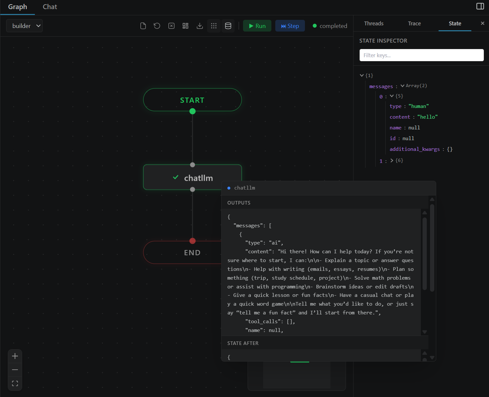
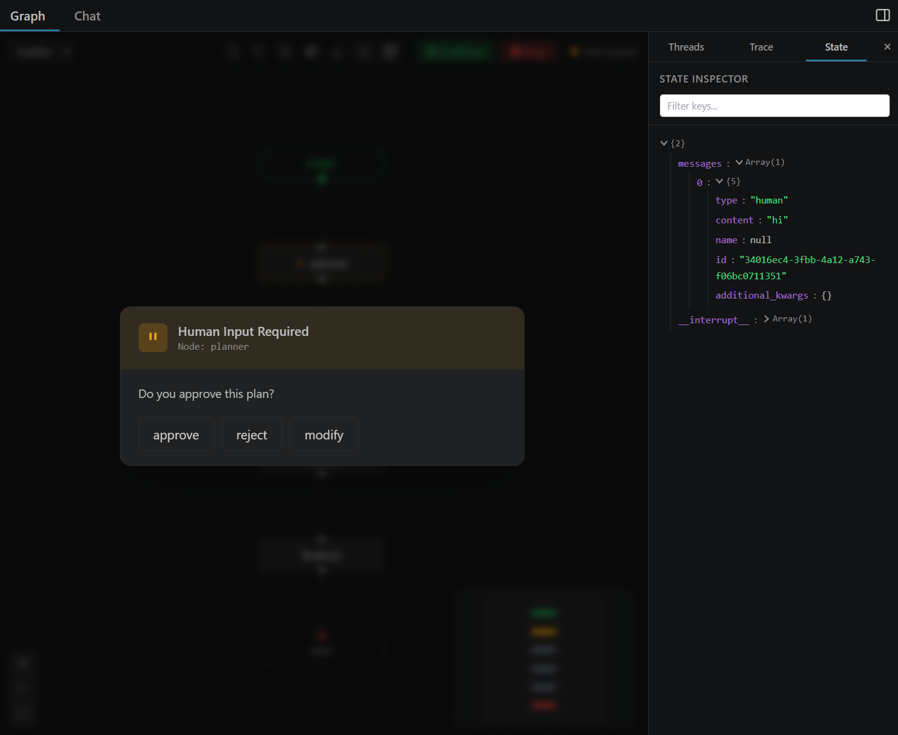

<div align="center">


# VizLang

**The open-source visual debugger for LangGraph agents.**

See your graph. Watch it think. Step through every node.

[](https://marketplace.visualstudio.com/items?itemName=vizlang.vizlang)
[](#requirements)
[](#license)
[](#contributing)

<br />



</div>

<br />

---

<br />

## The Problem

You build a LangGraph agent. It has 6 nodes, 3 conditional edges, a tool loop, and a human-in-the-loop step. Something goes wrong. You add `print()` statements. You stare at terminal output. You lose 45 minutes.

**VizLang fixes this.**

Right-click your Python file. Your agent's entire architecture appears on an interactive canvas. Click **Run** — watch nodes light up as they execute. Click **Step** — pause after each node and inspect the full state. Talk to your agent in the Chat tab. See tool calls, interrupts, and state changes in real time.

No cloud service. No API keys. No accounts. Everything runs locally.

<br />

## Features

<table>
<tr>
<td width="50%">

### Interactive Graph Canvas

Your agent's architecture rendered on an infinite canvas. Nodes, edges, conditional branches, loops — all draggable and zoomable. Auto-layout keeps things clean. Export as PNG when you need to share.

</td>
<td width="50%">



</td>
</tr>
<tr>
<td width="50%">



</td>
<td width="50%">

### Real-time Execution

Watch nodes light up green as they complete. Animated edges show data flowing through your graph. See exactly where your agent is at any moment. Errors turn nodes red immediately.

</td>
</tr>
<tr>
<td width="50%">

### Step-by-step Debugging

Pause after each node. Inspect the full state. Click **Next** to advance one step. Click **Continue All** to let it run. Like a line-by-line debugger, but for agent graphs.

</td>
<td width="50%">



</td>
</tr>
<tr>
<td width="50%">



</td>
<td width="50%">

### Chat Interface

Talk to your agent directly. Send messages, see streaming responses, view tool calls inline. Supports multimodal input — attach images, audio, and files. Toggle tool call visibility on/off.

</td>
</tr>
<tr>
<td width="50%">

### State Inspector

Hover any node to see the complete state snapshot at that point in execution. Scroll through large state objects. Pin the tooltip to keep it open while you explore nested data.

</td>
<td width="50%">



</td>
</tr>
<tr>
<td width="50%">



</td>
<td width="50%">

### Human-in-the-Loop

When your agent hits an interrupt, VizLang shows the decision inline — right on the graph. Approve, reject, or provide input without leaving VS Code. Works with LangGraph's `interrupt()` API.

</td>
</tr>
</table>

<br />

### And also...

- **Schema-aware input** — reads your graph's `TypedDict` schema and pre-fills the JSON input form
- **Thread management** — create, switch, clear, and delete conversation threads
- **Multiple graphs** — one file, many graphs? Select from the dropdown
- **Edge waypoints** — double-click edges to add control points, drag to reroute
- **Drag & drop** — drop a `.py` file onto the canvas to load it
- **Dark & light themes** — follows your VS Code theme
- **Memory toggle** — enable/disable checkpointing with one click
- **Minimap** — navigate large graphs at a glance
- **PNG export** — download your graph as a high-resolution image

<br />

---

<br />

## Quick Start

### 1. Install the extension

```bash
# From VS Code
# Search "VizLang" in Extensions (Ctrl+Shift+X)

# Or from terminal
code --install-extension vizlang.vizlang
```

### 2. Install Python dependencies

```bash
pip install langgraph langchain-core
```

### 3. Open your agent

Create a Python file with a compiled LangGraph:

```python
from langgraph.graph import START, END, StateGraph
from typing_extensions import TypedDict, Annotated
import operator

class State(TypedDict):
    messages: Annotated[list[str], operator.add]

def greeter(state: State):
    return {"messages": ["Hello! How can I help?"]}

def responder(state: State):
    return {"messages": ["Here's what I found..."]}

builder = StateGraph(State)
builder.add_node("greeter", greeter)
builder.add_node("responder", responder)
builder.add_edge(START, "greeter")
builder.add_edge("greeter", "responder")
builder.add_edge("responder", END)

graph = builder.compile()
```

### 4. Launch

**Right-click** the file → **"Open in VizLang"**

Or click the VizLang icon in the editor title bar. Or `Ctrl+Shift+P` → `VizLang: Load Graph`.

Your graph appears. Click **Run**. Watch it go.

<br />

---

<br />

## Supported Patterns

VizLang works with any LangGraph `StateGraph`:

| Pattern | Supported |
|---|---|
| Linear chains | ✅ |
| Conditional edges | ✅ |
| Tool-calling agents (ReAct) | ✅ |
| Human-in-the-loop (`interrupt()`) | ✅ |
| Multi-agent graphs | ✅ |
| Custom input/output schemas | ✅ |
| Private state (node-scoped types) | ✅ |
| `MemorySaver` checkpointing | ✅ |
| Graphs without checkpointers | ✅ |
| Multiple graphs per file | ✅ |

<br />

---

<br />

## Keyboard Shortcuts

| Action | Shortcut |
|---|---|
| Load graph | `Ctrl+Shift+P` → "VizLang: Load Graph" |
| Run graph | Click **▶ Run** |
| Step through | Click **⏭ Step** |
| Submit JSON input | `Ctrl+Enter` |
| Cancel input | `Escape` |
| Send chat message | `Enter` |
| New line in chat | `Shift+Enter` |
| Toggle chat tool calls | Click 🔧 icon |

<br />

---

<br />

## How It Works

```
┌──────────────┐     JSON-RPC      ┌──────────────┐
│   VS Code    │◄──── stdin/out ───►│   Python     │
│   Extension  │                    │   Bridge     │
│              │                    │              │
│  React Flow  │  stream events     │  LangGraph   │
│  Webview     │◄───────────────────│  .stream()   │
└──────────────┘                    └──────────────┘
```

VizLang spawns a Python subprocess that loads your `.py` file, finds compiled `StateGraph` objects, and communicates via JSON-RPC over stdin/stdout. The graph structure is rendered using [React Flow](https://reactflow.dev) in a VS Code webview. Execution uses LangGraph's `stream()` API with `values` and `updates` modes.

**Everything runs on your machine.** No data leaves your environment. No cloud. No telemetry.

<br />

---

<br />

## Requirements

| Dependency | Version |
|---|---|
| VS Code | 1.85+ |
| Python | 3.10+ |
| `langgraph` | 0.2+ |
| `langchain-core` | 0.3+ |

> **Note:** Use `typing_extensions.TypedDict` instead of `typing.TypedDict` on Python < 3.12 (Pydantic requirement).

<br />

---

<br />

## Contributing

VizLang is open source and we'd love your help. Whether it's a bug fix, new feature, docs improvement, or just a typo — all contributions are welcome.

See **[CONTRIBUTING.md](CONTRIBUTING.md)** for setup instructions and guidelines.

### Ways to contribute

- **Report bugs** — [open an issue](../../issues/new?template=bug_report.md) with steps to reproduce
- **Request features** — [start a discussion](../../issues/new?template=feature_request.md) about what you'd like to see
- **Fix issues** — look for [`good first issue`](../../labels/good%20first%20issue) labels
- **Improve docs** — better README, tutorials, examples
- **Add examples** — sample LangGraph agents that showcase different patterns
- **Write tests** — help us get to reliable coverage

### Development setup (30 seconds)

```bash
git clone https://github.com/anthropics/vizlang.git
cd vizlang
npm install
npm run build
# Press F5 in VS Code to launch Extension Host
```

<br />

---

<br />

## Roadmap

We're building in the open. Here's what's coming:

- [ ] **Trace timeline** — full execution trace with timing, expandable like Chrome DevTools
- [ ] **Time travel** — click any checkpoint to restore state
- [ ] **Subgraph drill-down** — click to zoom into nested graphs
- [ ] **Breakpoints** — set breakpoints on specific nodes
- [ ] **LangGraph Server** — connect to remote deployments
- [ ] **Graph diff** — compare runs side by side
- [ ] **Performance profiling** — identify slow nodes
- [ ] **Custom node renderers** — plugins for domain-specific visualization

Have an idea? [Open an issue](../../issues/new?template=feature_request.md).

<br />

---

<br />

## Acknowledgments

Built with [React Flow](https://reactflow.dev), [LangGraph](https://github.com/langchain-ai/langgraph), and [VS Code Extension API](https://code.visualstudio.com/api).

<br />

## License

MIT — see [LICENSE](LICENSE) for details.

<br />

---

<div align="center">

**If VizLang helps you debug faster, give it a ⭐**

[Install](https://marketplace.visualstudio.com/items?itemName=vizlang.vizlang) · [Report Bug](../../issues/new?template=bug_report.md) · [Request Feature](../../issues/new?template=feature_request.md) · [Contributing](CONTRIBUTING.md)

</div>
